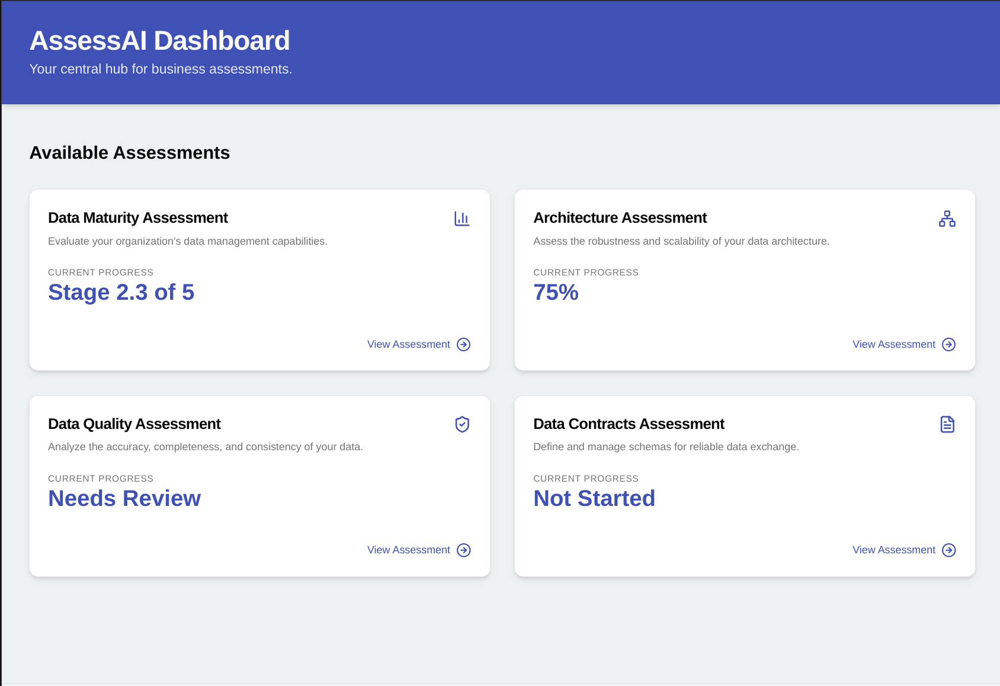

# AssessAI




<br />

## Running the Development Environment

To run the application locally, you'll need to have Node.js and npm (or yarn/pnpm) installed.

### 1. Install Dependencies

First, install the project dependencies:

```bash
npm install
# or
# yarn install
# or
# pnpm install
```

### 2. Run the Next.js Development Server

This command starts the Next.js application on `http://localhost:9002`.

```bash
npm run dev
```

### 3. Run the Genkit Development Server

Genkit is used for AI-related functionalities. You need to run its development server separately.

To run the Genkit server (it will typically run on `http://localhost:3400`):

```bash
npm run genkit:dev
```

Alternatively, if you want Genkit to automatically restart when its files change, use:

```bash
npm run genkit:watch
```

You should have both the Next.js server and the Genkit server running concurrently in separate terminal windows to use all features of the application.
